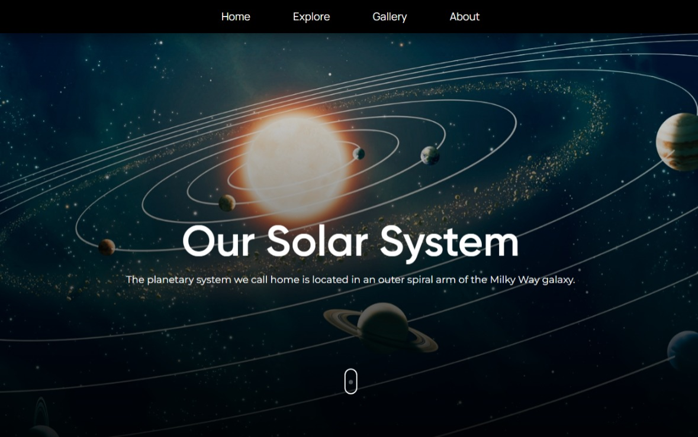

✨ &nbsp; Guardian of the Galaxy 🌌
====== 


An overview of our local neighborhood in the Orion arm of the Milky Way galaxy.

This is a Solar System website project built using HTML, CSS, and JavaScript. It provides an interactive exploration of the solar system, allowing users to learn about the planets and their characteristics.

## Demo

.

## Features

- Interactive visualization of the solar system.
- Detailed information about each planet, including size, distance from the sun, and composition.
- Dynamic animations and transitions for a visually engaging experience.
- User-friendly navigation and intuitive interface.
- Responsive design for seamless viewing on different devices.

## Technologies Used

- HTML
- CSS
- JavaScript

## Installation

Linux and macOS:

```bash
sudo git clone https://github.com/PrakasRavichandran/Solar-System.git
```

Windows:

```bash
git clone https://github.com/PrakasRavichandran/Solar-System.git
```

## Contributing

Contributions are welcome! If you have any ideas, improvements, or bug fixes, please submit a pull request.

## License

This project is free to use and does not contain any license.

## Acknowledgements

- Solar system data sourced from NASA's official website.

## Contact

For any inquiries or suggestions, please feel free to contact me at [Instagram](https://www.instagram.com/prakashravichandrann).


